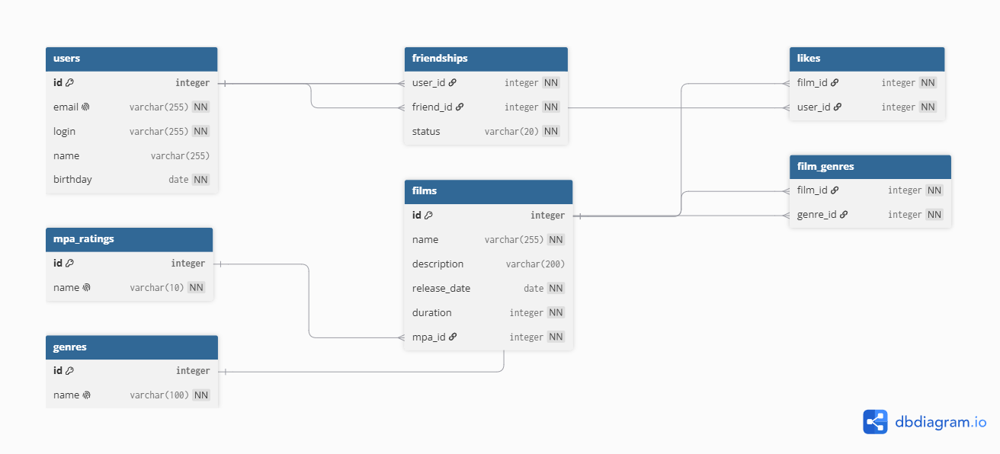

# 🎬 Filmorate - Схема базы данных

Схема реляционной базы данных для приложения Filmorate. Спроектирована с соблюдением принципов нормализации (1NF, 2NF,
3NF).

## 📊 ER-Диаграмма



## 🏗️ Описание таблиц

| Таблица       | Описание                                                            |
|---------------|---------------------------------------------------------------------|
| `users`       | Пользователи сервиса                                                |
| `films`       | Фильмы                                                              |
| `mpa_ratings` | Справочник возрастных рейтингов (G, PG, PG-13, R, NC-17)            |
| `genres`      | Справочник жанров фильмов                                           |
| `film_genres` | Связь фильмов с жанрами (Many-to-Many)                              |
| `friendships` | Связи между пользователями со статусом (`UNCONFIRMED`, `CONFIRMED`) |
| `likes`       | Лайки пользователей на фильмы                                       |

## 💻 Примеры SQL-запросов

### 1. Получить все фильмы с их рейтингом MPA

```sql
SELECT f.name,
       f.release_date,
       m.name AS mpa_rating
FROM films f
         JOIN mpa_ratings m ON f.mpa_id = m.id;
```

### 2. Получить топ-10 самых популярных фильмов (по лайкам)

```sql
SELECT f.name,
       COUNT(l.user_id) AS likes_count
FROM films f
         LEFT JOIN likes l ON f.id = l.film_id
GROUP BY f.id, f.name
ORDER BY likes_count DESC LIMIT 10;
```

### 3. Получить общих друзей двух пользователей (например, ID 1 и 2)

```sql

SELECT u.id, u.name, u.login, u.email, u.birthday
FROM users u
WHERE u.id IN (SELECT friend_id
               FROM friendships
               WHERE user_id = 1
                 AND status = 'CONFIRMED')
  AND u.id IN (SELECT friend_id
               FROM friendships
               WHERE user_id = 2
                 AND status = 'CONFIRMED');
```

